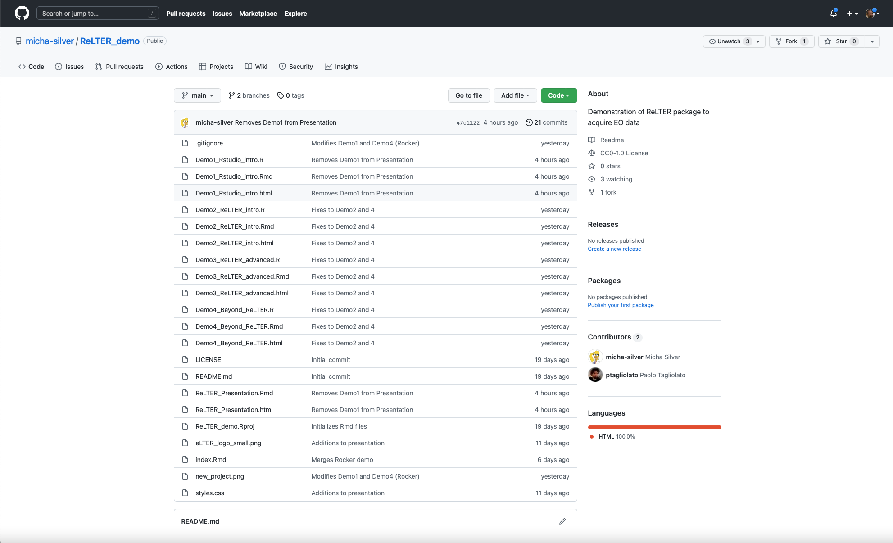

```{r setup1, include=FALSE, purl=FALSE}
knitr::opts_chunk$set(echo = TRUE)
```

## This Demo

  - Rmarkdown: cloned from https://github.com/micha-silver/ReLTER_demo
  
{.cover height=300 width=400}

  - Slides on website: https://micha-silver.github.io/index.html
  - Youtube videos: (*to be announced*)


## Beginning with RStudio and git {data-background=figures/eLTER_strip+logo.png, data-background-position=center data-background-size=800px}

#### Start a new package **based on a git repo**.


Encourages collaboration "out of the box".

https://github.com/micha-silver/ReLTER_demo

----

#### Basics of git:

  - https://git-scm.com/book/en/v2/Git-Basics-Getting-a-Git-Repository
  - https://r-bio.github.io/intro-git-rstudio/
  
#### Some online resources
 - R for Data Science: https://r4ds.had.co.nz/index.html 
 - FasteR: https://github.com/matloff/fasteR
 - Rseek: https://rseek.org/
 

----

#### RStudio hints

  - Always work in an R project
  - Use a git repo for collaboration
  - Do **not** `setwd()`
  - Do **not save workspace** to `.Rdata`
  - Use Control+Shift+F10 often
 
#### Markdown versus `R` script
 - Code is the same
 - RMarkdown adds formatted text and outputs
 - RMarkdown can produce output in html, pdf, and slides
 - Perfect for reports and ... demos


## Where to get `R` packages
 
 - General (statistics, spatial, ML etc.): CRAN: https://cran.r-project.org/
 - BioConductor (biology, environment): https://www.bioconductor.org/install/
 - Packages developed on github, i.e. `ReLTER`
 - `R`OpenSci (platform for vetted and open `R` packages)
 
{.cover height="325"}

----

#### Installing packages

```{r intro-packages, message=FALSE, warning=FALSE}
# Install some standard spatial packages from CRAN
if (!require("sf", quietly = TRUE))
  install.packages("sf")
if (!require("terra", quietly = TRUE))
  install.packages("terra")

# package from Bioconductor
if (!require("BiocManager", quietly = TRUE))
  install.packages("BiocManager")
BiocManager::install()
BiocManager::install("EBImage")
```

----

#### Installing from github

```{r intro-from-github, message=FALSE, warning=FALSE}
# Install development package from github
if (!require("remotes", quietly = TRUE))
  install.packages("remotes")

if (!require("ReLTER", quietly = TRUE))
  remotes::install_github("ropensci/ReLTER")
``` 


## Loading packages

After installing, we need to load the packages into this `R` session.

```{r intro-loading, message=FALSE, warning=FALSE}
# Convenient way to load list of packages
pkg_list <- c("sf", "terra", "ReLTER", "tmap")
lapply(pkg_list, require, character.only = TRUE)
```

## R Spatial

#### Key packages

  - Handling vector data: `sf`, `terra`
  - Handling raster data: `terra`, `stars`
  - Visualization: `tmap`, `leaflet`, `ggmap`, (`plot`)
  - Old, deprecated packages: ~~sp~~, ~~rgdal~~, ~~raster~~, ~~rgeos~~

#### Online resources

  - Geocomputation with R: https://geocompr.robinlovelace.net/
  - Spatial Data Science: https://www.rspatial.org/
  - A blog on R-spatial issues: https://r-spatial.org/
  - Packages are maintained here: https://github.com/rspatial
  - R-SIG_Geo Mailist: https://stat.ethz.ch/mailman/listinfo/R-SIG-Geo/

----

#### An initial example

Use the `geodata` package for sample data. Get administrative boundaries (from GADM) and monthly precipitation rasters (from WorldClim) for Slovakia.

```{r intro-spatial, message=FALSE, warning=FALSE}
remotes::install_github("rspatial/geodata")
library(geodata)
slv <- gadm("Slovakia", level=2, path=tempdir())
# Convert to `sf` class for plotting
slv <- st_as_sf(slv)
slv_precip <- worldclim_country("Slovakia",
                                var = "prec", path = tempdir())
```

----

Display the data with `tmap`, and use OpenStreetMaps as background.

```{r intro-slovakia, message=FALSE, warning=FALSE}
tmap_mode("view")
tm_basemap("OpenStreetMap.Mapnik") +
  tm_shape(slv) + tm_borders(col = "purple", lwd = 2) +
  tm_shape(slv_precip$SVK_wc2.1_30s_prec_1) + 
  tm_raster(palette = "YlGnBu", alpha=0.7)
```

----

Now a different month

```{r intro-slovakia2}
tm_basemap("OpenStreetMap.Mapnik") +
  tm_shape(slv) + tm_borders(col = "purple", lwd = 2) +
  tm_shape(slv_precip$SVK_wc2.1_30s_prec_8) +
  tm_raster(palette = "YlGnBu", alpha=0.7)
```
